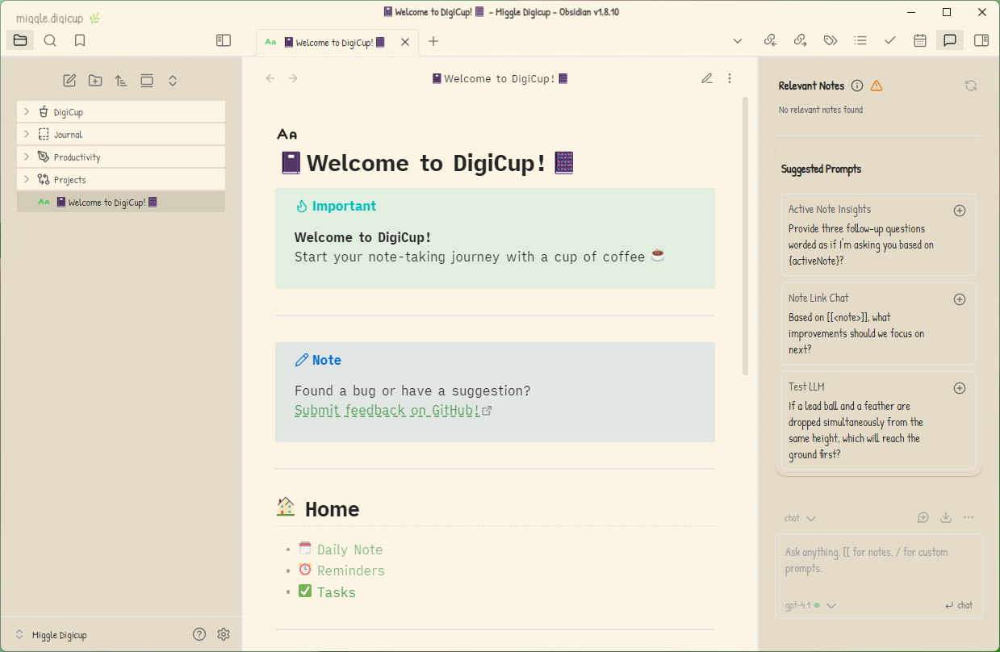

# DigiCup🌿

**digicup** is a cozy and focused note-taking system powered by [Obsidian](https://obsidian.md/).

## Features

- Minimal and distraction-free interface
- Designed for efficient note organization
- Seamless integration with Obsidian plugins
- AI Chat on the Sidebar

## Screenshot

## Getting Started

1. Clone this repository.
2. Copy the `digicup` folder to anywhere you won't delete it
3. Open it
4. Start Taking Notes!

## License

[MIT License](./LICENSE)

